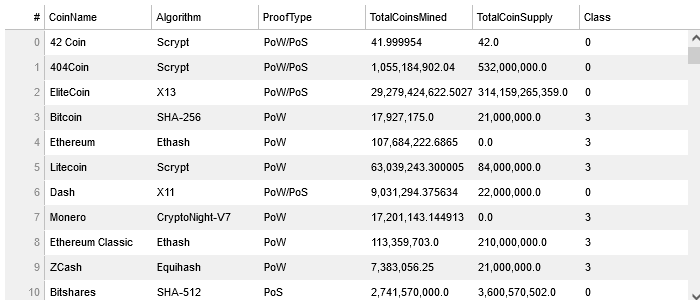
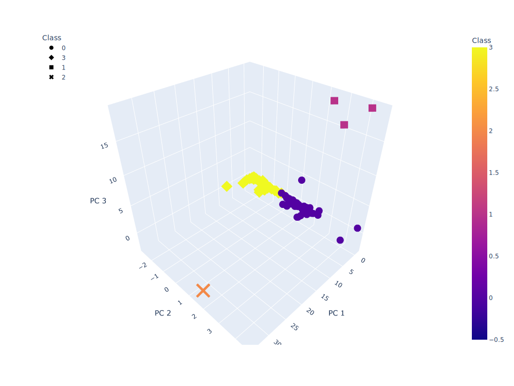
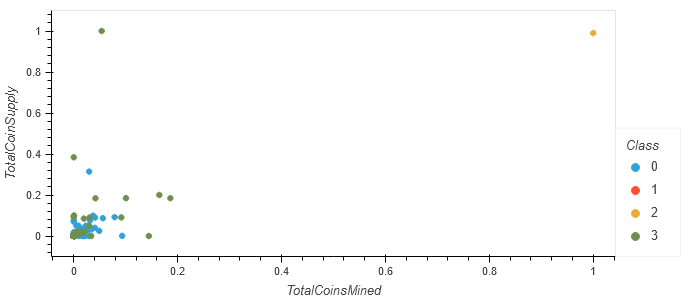

# Crypto Currencies Analysis using Clustering

# Background:
Accountability Accounting, a prominent investment bank, is interested in offering a new cryptocurrency investment portfolio for its customers. The company, however, is lost in the vast universe of cryptocurrencies. 

# Problem Statement:
Identify what cryptocurrencies are on the trading market and how they could be grouped to create a classification system for this new investment.

# Deliverables:
* Deliverable 1: Preprocessing the Data for PCA
* Deliverable 2: Reducing Data Dimensions Using PCA
* Deliverable 3: Clustering Cryptocurrencies Using K-means
* Deliverable 4: Visualizing Cryptocurrencies Results

## There are 532 total tradable crypto currencies in the dataset

## A table of the 532 crypto currencies currencies is available at the following link:
also available in the notebook

[link to crypto_table](https://jamie-miller-rva.github.io/crypto_table/)

<<<<<<< HEAD

## A 3D Visualization of the 532 crypto currencies grouped along 3 principal components (via Pincipal Component Analysis)
=======
## A 3D Visualization of the 532 crypto currencies along 3 principal components (via Pincipal Component Analysis)
The visualization groups the 532 crypto currencies into one of four groups using KMeans analysis to view similarities (or differences)
>>>>>>> f3fd1fc916a493d71dc9f8d0cdb108f056850d2f
see the notebook for an interactive visualization

## A Grouping of Crypto Currencies on a Scatter Plot of TotalCoinsMined vs. TotalCoinsSupply (scaled using StandardScaler)
The visualization groups the 532 crypto currencies into one of our groups using KMeans analysis to view similarities (or differences)
see the notebook for an interactive visualization

